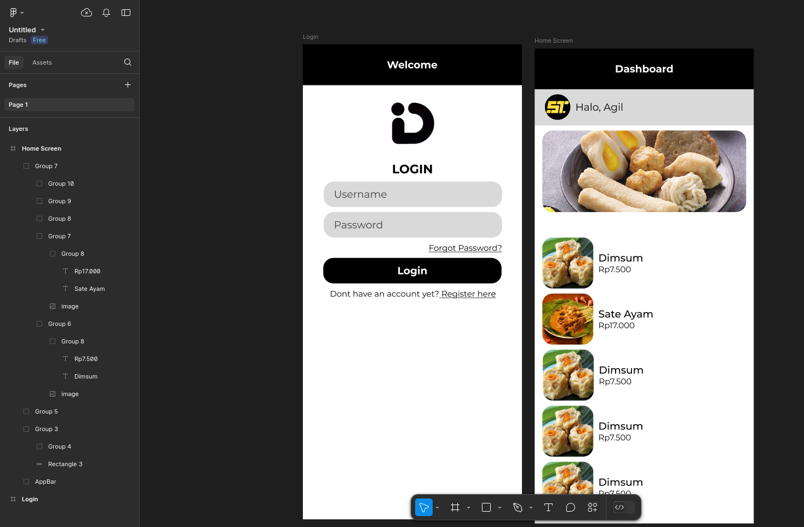
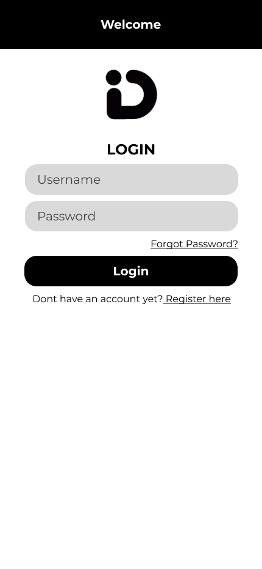
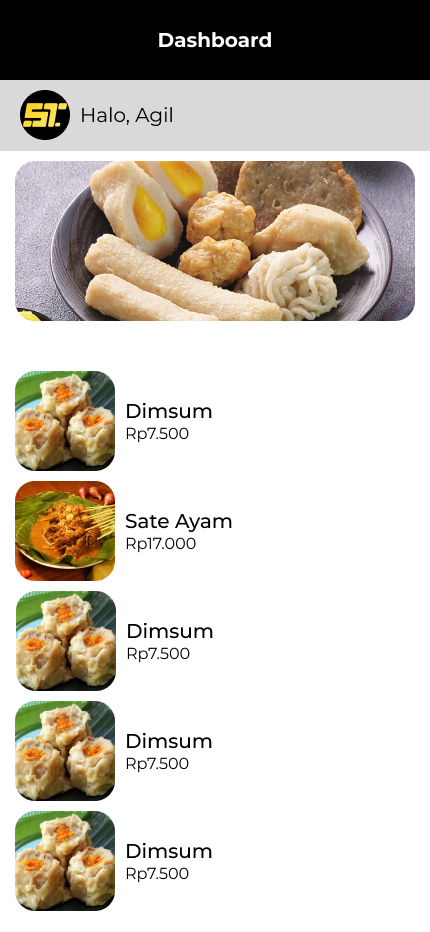
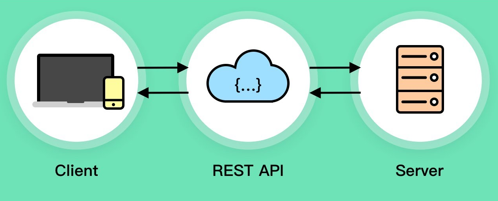
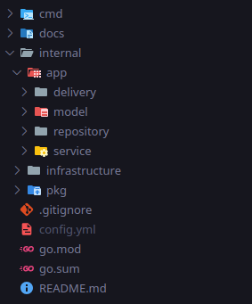
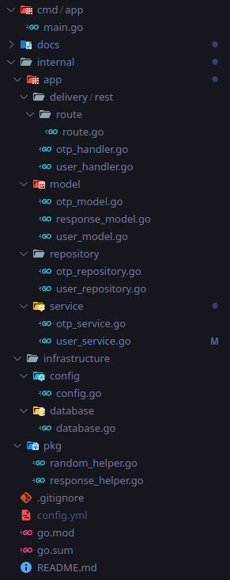
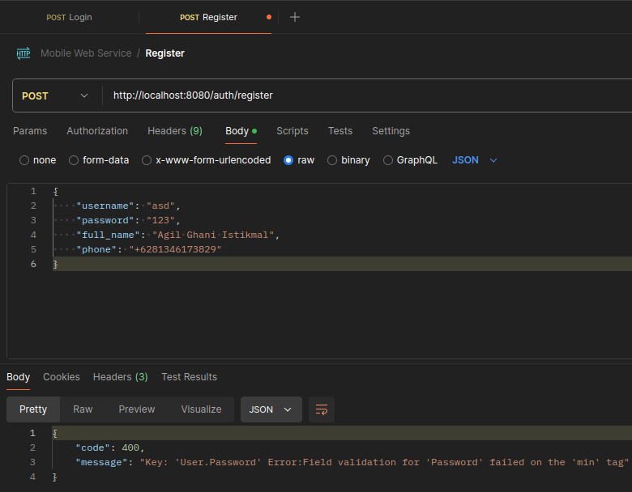
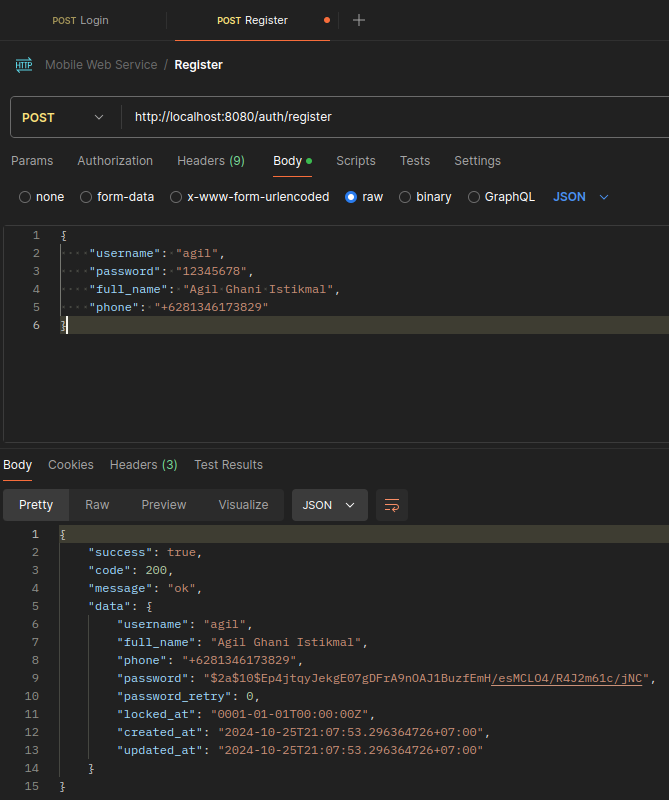
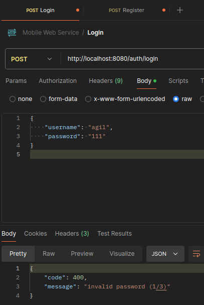
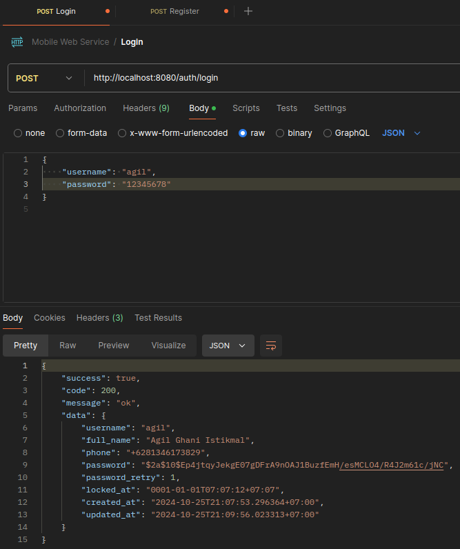

# Pertemuan 5 <!-- omit in toc -->
## Data diri

| Nama                | NPM        |
| ------------------- | ---------- |
| Agil Ghani Istikmal | 5220411040 |

---

## Daftar Isi

- [Data diri](#data-diri)
- [Daftar Isi](#daftar-isi)
- [Design Figma](#design-figma)
- [REST API](#rest-api)
  - [HTTP Methods](#http-methods)
    - [GET](#get)
      - [GET /user](#get-user)
      - [GET /user/:username](#get-userusername)
    - [POST](#post)
      - [POST /user](#post-user)
    - [PUT](#put)
      - [PUT /user/:username](#put-userusername)
    - [PATCH](#patch)
      - [PATCH /user/:username](#patch-userusername)
    - [DELETE](#delete)
      - [DELETE /user/:username](#delete-userusername)
- [API User Login](#api-user-login)
  - [Struktur Folder](#struktur-folder)
  - [Model](#model)
    - [User Model](#user-model)
    - [Response Model](#response-model)
  - [Repository](#repository)
  - [Service](#service)
  - [Delivery REST API Handler](#delivery-rest-api-handler)
    - [user\_handler.go](#user_handlergo)
    - [route.go](#routego)
  - [Main](#main)
  - [Testing Postman](#testing-postman)
    - [Register - Error Validation](#register---error-validation)
    - [Register - Success](#register---success)
    - [Login - Error Invalid Password](#login---error-invalid-password)
    - [Login - Success](#login---success)


## Design Figma

Figma adalah salah satu aplikasi yang dapat digunakan untuk membuat design mobile. Figma dapat diakses melalui website [figma.com](https://figma.com) maupun aplikasi desktop.

<p align="center">
  
<p>

<p align="center">
  
  
<p>

## REST API

REST API atau RESTful API yang memiliki kepanjangan **RE**presentational **S**tate **T**ransfer adalah salah satu cara berkomunikasi antar client-server menggunakan protokol HTTP. <br>

Gambaran sederhananya, client mengirim request ke endpoint tertentu, dan dikembalikan response nya saat request telah selesai diproses. <br>

REST menggunakan JSON untuk request body dan response body nya.

<p align="center">
  
<p>

### HTTP Methods

Karena REST API menggunakan protokol HTTP, maka ada beberapa protokol HTTP yang sering digunakan untuk membuat RESTful API.

#### GET

Method GET biasanya digunakan untuk menampilkan daftar data atau detail tentang data tersebut.

##### GET /user

Contohnya dengan endpoint GET `http://localhost:3000/user`
Ini digunakan untuk mengambil daftar data user yang ada di database. <br>

Contoh Response:

```json
{
  "status": 200,
  "message": "ok",
  "data": [
    {
      "username": "agilistikmal",
      "full_name": "Agil Ghani Istikmal",
      "phone": "+6281346173829",
      "created_at": "...",
      "updated_at": "..."
    },
    {
      "username": "ghani",
      "full_name": "Ghani Istikmal Agil",
      "phone": "++628123456789",
      "created_at": "...",
      "updated_at": "..."
    },
  ]
}
```

##### GET /user/:username

Ini untuk menampilkan 1 data detail tentang user dengan username tersebut. Contohnya `GET /user/agilistikmal` <br>

Contoh Response:

```json
{
  "status": 200,
  "message": "ok",
  "data": {
    "username": "agilistikmal",
    "full_name": "Agil Ghani Istikmal",
    "phone": "+6281346173829",
    "created_at": "...",
    "updated_at": "..."
  }
}
```

#### POST

POST digunakan untuk membuat atau input data baru. POST menyertakan body berupa JSON. <br>

##### POST /user

```json
{
  "username": "agilistikmal",
  "full_name": "Agil Ghani Istikmal",
  "phone": "+6281346173829"
}
```

Contoh Response:

```json
{
  "status": 200,
  "message": "ok",
  "data": {
    "username": "agilistikmal",
    "full_name": "Agil Ghani Istikmal",
    "phone": "+6281346173829",
    "created_at": "...",
    "updated_at": "..."
  }
}
```

#### PUT

PUT digunakan untuk mengubah dengan menyertakan keseluruhan data baru. <br>

##### PUT /user/:username

Contohnya ingin mengubah data user agilistikmal `PUT /user/agilistikmal`

```json
{
  "username": "agil_baru",
  "full_name": "Agil Punya Nama Baru",
  "phone": "+62812345789"
}
```

Contoh Response:

```json
{
  "status": 200,
  "message": "ok",
  "data": {
    "username": "agil_baru",
    "full_name": "Agil Punya Nama Baru",
    "phone": "+62812345789",
    "created_at": "...",
    "updated_at": "..."
  }
}
```

#### PATCH

PATCH digunakan untuk mengubah sebagian data saja. <br>

##### PATCH /user/:username

Contohnya ingin mengubah data full_name pada user agilistikmal `PATCH /user/agil_baru`

```json
{
  "full_name": "Agil Saja",
}
```

Contoh Response:

```json
{
  "status": 200,
  "message": "ok",
  "data": {
    "username": "agil_baru",
    "full_name": "Agil saja",
    "phone": "+62812345789",
    "created_at": "...",
    "updated_at": "..."
  }
}
```

#### DELETE

Method DELETE digunakan untuk menghapus data

##### DELETE /user/:username

`DELETE /user/agil_baru` maka akan menghapus data user dengan username agil_baru

Contoh Response:

```json
{
  "status": 200,
  "message": "ok",
  "data": {
    "username": "agil_baru",
    "full_name": "Agil saja",
    "phone": "+62812345789",
    "created_at": "...",
    "updated_at": "..."
  }
}
```

## API User Login

Saya membuat API untuk user melakukan login menggunakan Golang. <br>

### Struktur Folder

Berikut adalah struktur folder untuk membuat REST API di Golang.

<p align="center">
  
  
<p>

### Model

Mempersiapkan model untuk disimpan di database dan ditampilkan sebagai response. <br>

Saya menggunakan GORM sebagai ORM (Object Relational Mapping) untuk membuat tabel di database berdasarkan struct golang.

#### User Model
```go
package model

import "time"

type User struct {
	Username      string    `json:"username,omitempty" gorm:"primaryKey" validate:"required,min=3,max=20"`
	FullName      string    `json:"full_name,omitempty" validate:"required,min=3,max=50"`
	Phone         string    `json:"phone,omitempty" validate:"required,e164"`
	Password      string    `json:"password,omitempty" validate:"required,min=8"`
	PasswordRetry *int      `json:"password_retry,omitempty" gorm:"default:0"`
	CreatedAt     time.Time `json:"created_at,omitempty"`
	UpdatedAt     time.Time `json:"updated_at,omitempty"`
}
```

#### Response Model

Response model digunakan untuk menampilkan response dalam bentuk JSON kepada client.

```go
package model

type Response struct {
	Success bool   `json:"success,omitempty"`
	Code    int    `json:"code,omitempty"`
	Message string `json:"message,omitempty"`
	Data    any    `json:"data,omitempty"`
}

```

Contoh Response:

```json
{
  "success": true,
  "code": 200,
  "message": "ok",
  "data": {
    "username": "agilistikmal",
    ...
  }
}
```

### Repository

Folder repository berisi repository sebagai penghubung ke database.

```go
package repository

import (
	"github.com/agilistikmal/uty-mobile-web-service-api/internal/app/model"
	"gorm.io/gorm"
)

// Struct User Repository
type UserRepository struct {
	// Field db untuk mengakses database
	db *gorm.DB
}

// Constructor untuk membuat user repository
func NewUserRepository(db *gorm.DB) *UserRepository {
	return &UserRepository{
		db: db,
	}
}

// Untuk membuat user baru
func (r *UserRepository) Create(user *model.User) (*model.User, error) {
	// Argumen user akan dibuat ke database
	// lalu akan diperbarui datanya saat selesai dibuat
	err := r.db.Create(&user).Error
	if err != nil {
		return nil, err
	}

	return user, nil
}

// Untuk mencari user berdasarkan username
func (r *UserRepository) Find(username string) (*model.User, error) {
	// Membuat variable untuk menyimpan data user
	var user *model.User
	err := r.db.Take(&user, "username = ?", username).Error
	if err != nil {
		return nil, err
	}

	return user, nil
}

// Untuk mengupdate user
func (r *UserRepository) Update(username string, user *model.User) (*model.User, error) {
	err := r.db.Where("username = ?", username).Updates(&user).Error
	if err != nil {
		return nil, err
	}

	return user, nil
}

```

### Service

Service digunakan untuk business logic aplikasi. Contohnya untuk user service akan menangani logic untuk melakukan login, register, besereta validasi.

```go
package service

import (
	"fmt"

	"github.com/agilistikmal/uty-mobile-web-service-api/internal/app/model"
	"github.com/agilistikmal/uty-mobile-web-service-api/internal/app/repository"
	"github.com/go-playground/validator/v10"
	"golang.org/x/crypto/bcrypt"
)

type UserService struct {
	// Inject user repository untuk mengakses user
	userRepository *repository.UserRepository
	// Validate untuk melakukan validasi data
	validate *validator.Validate
}

func NewUserService(userRepository *repository.UserRepository, validate *validator.Validate) *UserService {
	return &UserService{
		userRepository: userRepository,
		validate:       validate,
	}
}

func (s *UserService) Register(user *model.User) (*model.User, error) {
	// Melakukan validasi data user
	// apakah sesuai dengan kontrak yang dibuat di model.
	err := s.validate.Struct(user)
	if err != nil {
		return nil, err
	}

	// Melakukan hashing password menggunakan bcrypt
	hashPassword, err := bcrypt.GenerateFromPassword([]byte(user.Password), 10)
	if err != nil {
		return nil, err
	}

	user.Password = string(hashPassword)
	user.Verified = false

	user, err = s.userRepository.Create(user)
	return user, err
}

func (s *UserService) Login(username string, password string) (*model.User, error) {
	// Mencari data user
	user, err := s.userRepository.Find(username)
	if err != nil {
		return nil, err
	}

	now := time.Now()
	difference := now.Sub(user.LockedAt)
	retrySeconds := 10

	if difference < time.Duration(retrySeconds)*time.Second {
		return nil, fmt.Errorf("account locked, please wait %ds", retrySeconds-int(difference.Seconds()))
	}

	err = bcrypt.CompareHashAndPassword([]byte(user.Password), []byte(password))
	if err != nil {
		// Untuk melakukan locking jika 3x password salah
		maxRetry := 3
		if *user.PasswordRetry < maxRetry {
			*user.PasswordRetry += 1
		} else {
			*user.PasswordRetry = 0
			user.LockedAt = time.Now()
		}
		_, err := s.userRepository.Update(user.Username, user)
		if err != nil {
			return nil, err
		}
		return nil, fmt.Errorf("invalid password (%d/3)", *user.PasswordRetry)
	}

	return user, nil
}

```

### Delivery REST API Handler

Berikutnya adalah menghandle request dari client dan meneruskan ke service lalu mengembalikan hasilnya dengan response.

#### user_handler.go

Pada file ini berisikan logic saat request diterima dan apa yang dilakukan setelah request diterima.

```go
package rest

import (
	"encoding/json"
	"net/http"

	"github.com/agilistikmal/uty-mobile-web-service-api/internal/app/model"
	"github.com/agilistikmal/uty-mobile-web-service-api/internal/app/service"
	"github.com/agilistikmal/uty-mobile-web-service-api/internal/pkg"
)

type UserHandler struct {
	service    *service.UserService
	otpService *service.OTPService
}

func NewUserHandler(service *service.UserService, otpService *service.OTPService) *UserHandler {
	return &UserHandler{
		service:    service,
		otpService: otpService,
	}
}

func (h *UserHandler) Register(w http.ResponseWriter, r *http.Request) {
	// Melakukan konversi request body JSON ke struct model user
	var user *model.User
	err := json.NewDecoder(r.Body).Decode(&user)
	if err != nil {
		pkg.SendError(w, http.StatusInternalServerError, err.Error())
		return
	}

	// Melakukan registrasi user
	user, err = h.service.Register(user)
	if err != nil {
		pkg.SendError(w, http.StatusBadRequest, err.Error())
		return
	}

	pkg.SendSuccess(w, user)
}

func (h *UserHandler) Login(w http.ResponseWriter, r *http.Request) {
	// Melakukan konversi request body JSON ke struct model user
	var user *model.User
	err := json.NewDecoder(r.Body).Decode(&user)
	if err != nil {
		pkg.SendError(w, http.StatusInternalServerError, err.Error())
		return
	}

	// Melakukan login
	user, err = h.service.Login(user.Username, user.Password)
	if err != nil {
		pkg.SendError(w, http.StatusBadRequest, err.Error())
		return
	}

	pkg.SendSuccess(w, user)
}

```

#### route.go

File ini untuk mendaftarkan routing dengan method dan endpoint tertentu.

```go
package route

import (
	"net/http"

	"github.com/agilistikmal/uty-mobile-web-service-api/internal/app/delivery/rest"
)

type Route struct {
	Mux *http.ServeMux

	UserHandler *rest.UserHandler
}

func NewRoutes(userHandler *rest.UserHandler, otpHandler *rest.OTPHandler) *Route {
	return &Route{
		Mux:         http.NewServeMux(),
		UserHandler: userHandler,
	}
}

func (r *Route) Init() {
	r.ProductRoutes()
}

func (r *Route) ProductRoutes() {
	// Mendaftarkan user handler dengan endpoint
	r.Mux.HandleFunc("POST /auth/register", r.UserHandler.Register)
	r.Mux.HandleFunc("POST /auth/login", r.UserHandler.Login)
}

```

### Main

Pada akhirnya, semuanya dijahit dalam file `main.go` untuk menjalankan keseluruhannya.

```go
package main

import (
	"log"
	"net/http"

	"github.com/agilistikmal/uty-mobile-web-service-api/internal/app/delivery/rest"
	"github.com/agilistikmal/uty-mobile-web-service-api/internal/app/delivery/rest/route"
	"github.com/agilistikmal/uty-mobile-web-service-api/internal/app/repository"
	"github.com/agilistikmal/uty-mobile-web-service-api/internal/app/service"
	"github.com/agilistikmal/uty-mobile-web-service-api/internal/infrastructure/config"
	"github.com/agilistikmal/uty-mobile-web-service-api/internal/infrastructure/database"
	"github.com/go-playground/validator/v10"
)

func main() {
        // Memuat configurasi config.yml
	config.NewConfig()

        // Inisialisasi database dan validator
	db := database.NewDatabase()
	validate := validator.New()

        // Inject repository dan service
	userRepository := repository.NewUserRepository(db)
	userService := service.NewUserService(userRepository, validate)

	// REST Handler
	userHandler := rest.NewUserHandler(userService, otpService)

	routes := route.NewRoutes(userHandler)
	routes.Init()

        // Menjalankan di port 8080
	log.Println("Running on http://localhost:8080")
	http.ListenAndServe(":8080", routes.Mux)
}

```

### Testing Postman

#### Register - Error Validation

Disini mencoba untuk validasi, berhasil terlihat bahwa password tidak memenuhi minimal 8 karakter.

<p align="center">
  
<p>

#### Register - Success

Setelah valid, maka akan berhasil melakukan registrasi seperti berikut.

<p align="center">
  
<p>

#### Login - Error Invalid Password

Terdapat pesan peringatan saat password salah. Setelah 3x maka akun akan di lock selama 30 detik.

<p align="center">
  
<p>

#### Login - Success

<p align="center">
  
<p>