# Pertemuan 6 <!-- omit in toc -->

## Data diri

| Nama                | NPM        |
| ------------------- | ---------- |
| Agil Ghani Istikmal | 5220411040 |

---

## Daftar Isi

- [Data diri](#data-diri)
- [Daftar Isi](#daftar-isi)
- [Konversi Figma ke Flutter](#konversi-figma-ke-flutter)
  - [Login \& Register](#login--register)
  - [OTP \& Home](#otp--home)
  - [Payment](#payment)
  - [Home (Verified)](#home-verified)
- [API OTP](#api-otp)
  - [Send OTP](#send-otp)
  - [Send OTP - Golang](#send-otp---golang)
    - [OTP Model](#otp-model)
    - [OTP Repository](#otp-repository)
    - [OTP Service](#otp-service)
- [API Payment Gateway](#api-payment-gateway)
- [Integrasi Flutter dan API](#integrasi-flutter-dan-api)
  - [Import HTTP](#import-http)
  - [Login](#login)
  - [Register](#register)
  - [OTP Verify](#otp-verify)
  - [Upgrade Account (Create Payment)](#upgrade-account-create-payment)
  - [WebView Xendit/Payment](#webview-xenditpayment)
  - [Confirm/Refresh Payment Status](#confirmrefresh-payment-status)

## Konversi Figma ke Flutter

Sebelumnya saya merubah desain figma dari warna hitam menjadi hijau, dan menambahkan beberapa halaman baru seperti berikut.

<p align="center">
	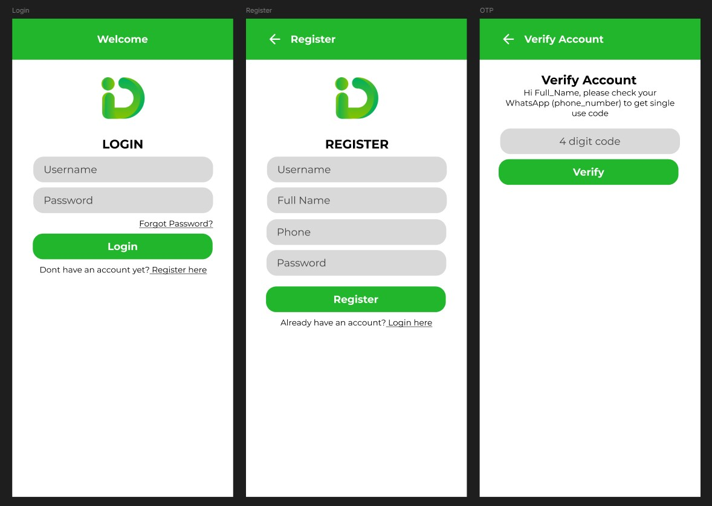
</p>

<p align="center">
	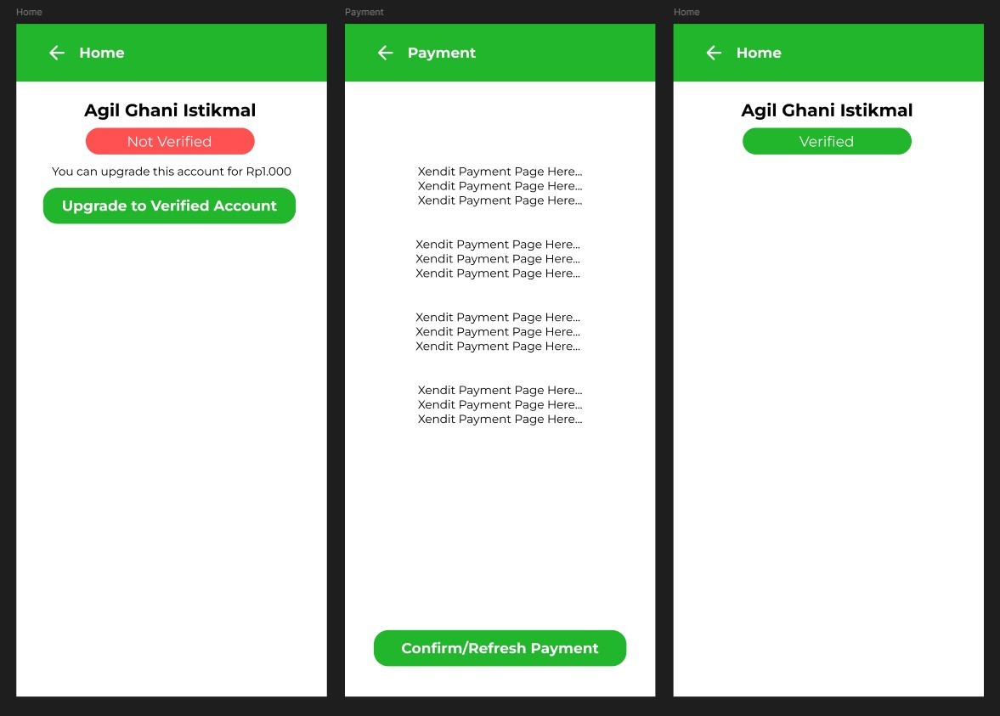
</p>

Untuk membantu konversi ke flutter, bisa melihat dari property desain di figma. <br>
Ini membantu untuk mengetahui warna, ukuran, padding, font size, font type, dan lain lain.

<p align="center">
	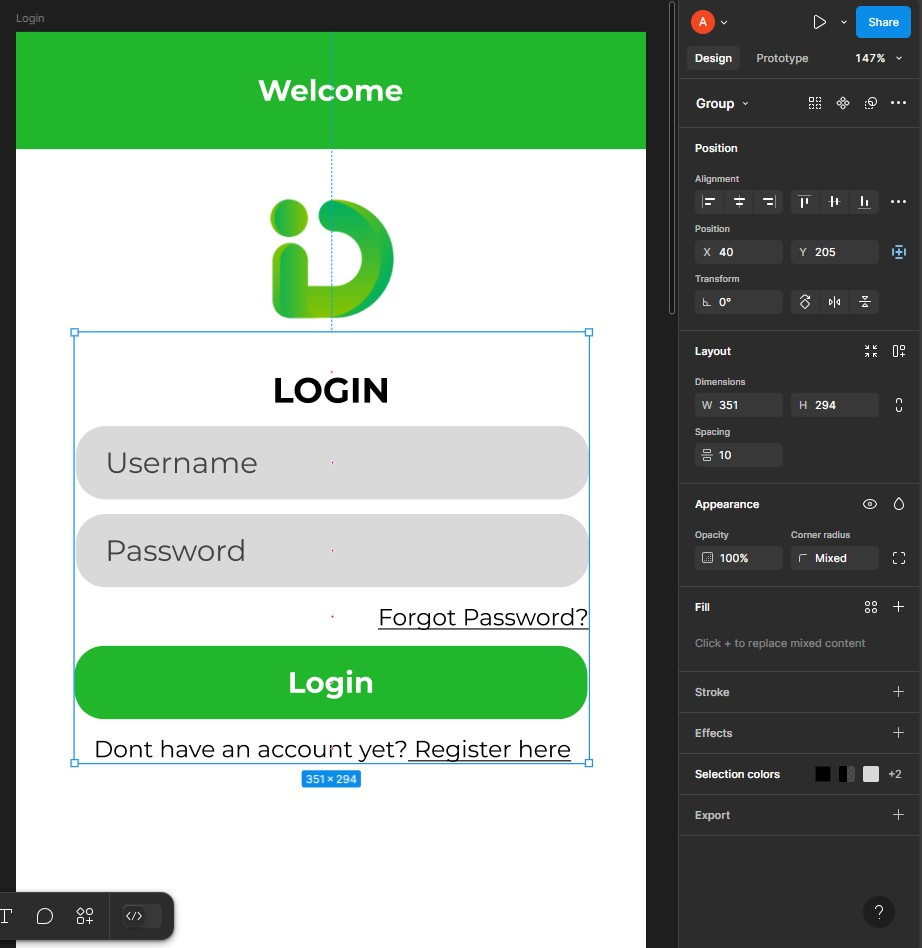
</p>

Sehingga hasil akhir nya seperti berikut ini.

### Login & Register

<p align="center">
	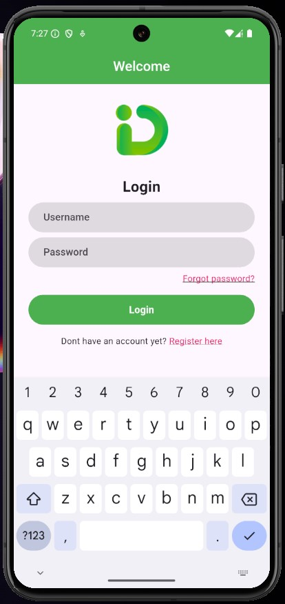
	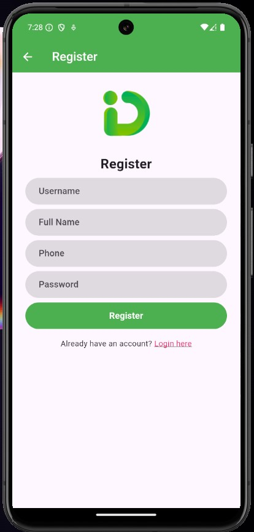
</p>

### OTP & Home

<p align="center">
	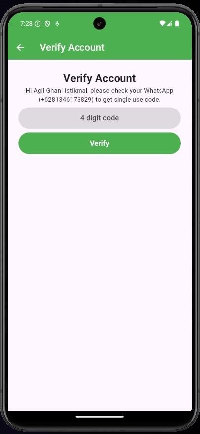
	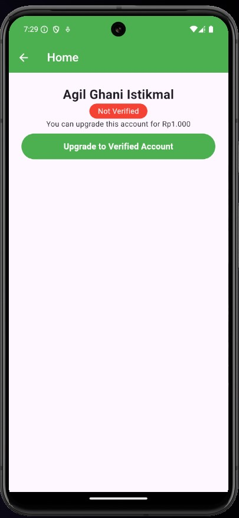
</p>

### Payment

<p align="center">
	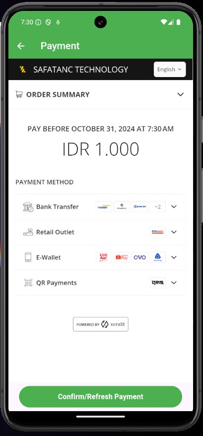
	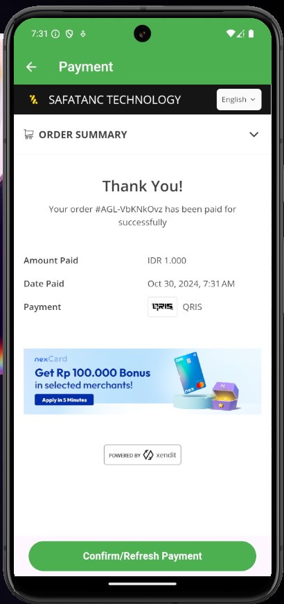
</p>

### Home (Verified)

<p align="center">
	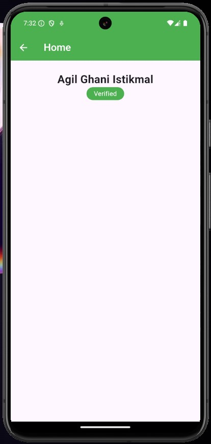
</p>

## API OTP

OTP digunakan untuk mengirim kode verifikasi kepada user. Ini untuk membuktikan bahwa yang mengakses adalah user tersebut untuk mengurangi resiko dihack. <br>
Saya menggunakan [WAHA](https://waha.devlike.pro/) untuk mengirimkan OTP melalui **WhatsApp**. WAHA adalah 3rd party API open source yang dapat mengirimkan pesan melalui whatsapp. Saya menghosting sendiri WAHA di VPS yang dapat diakses melalui https://waha.safatanc.com dengan nomor [+6285888881550](https://wa.me/6285888881550) <br>

### Send OTP

Untuk mengirimkan pesan cukup memanggil API dari WAHA. <br>
Melalui endpoint POST /api/sendText <br>

Contohnya POST https://waha.safatanc.com/api/sendText

```json
{
  "session": "default",
  "chatId": "6281346173829@c.us",
  "text": "Hi there!"
}
```

<p align="center">
	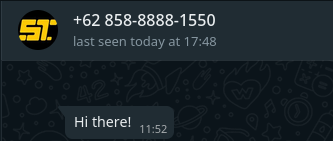
</p>

### Send OTP - Golang

Berikut adalah cara mengirim OTP melalui golang. OTP dikirim saat melakukan register dan login. <br>

1. OTP dibuat dengan 4 digit huruf random
2. OTP disimpan dalam tabel OTP dengan expired time 10 menit
3. OTP dikirim melalui whatsapp ke nomor user

#### OTP Model

```go
package model

import "time"

type OTP struct {
	Username  string    `json:"username,omitempty" gorm:"primaryKey"`
	Code      string    `json:"code,omitempty"`
	ExpiredAt time.Time `json:"expired_at,omitempty"`
	CreatedAt time.Time `json:"created_at,omitempty"`
	UpdatedAt time.Time `json:"updated_at,omitempty"`
}

```

#### OTP Repository

Repository untuk membuat random code dan menyimpannya di database.

```go
package repository

...

func (r *OTPRepository) Create(username string) (*model.OTP, error) {
	code := pkg.RandomString(4)

	otp := &model.OTP{
		Username:  username,
		Code:      code,
		ExpiredAt: time.Now().Add(10 * time.Minute),
	}

	err := r.db.Save(&otp).Error
	if err != nil {
		return nil, err
	}

	return otp, nil
}

```

#### OTP Service

Service untuk logic saat ingin membuat code dan mengirimkannya ke user. <br>
Template message OTP diambil dari file `config.yml`

```go
package service

...

func (s *OTPService) Generate(username string) (*model.OTP, error) {
	user, err := s.userRepository.Find(username)
	if err != nil {
		return nil, err
	}

	otp, err := s.otpRepository.Create(user.Username)
	if err != nil {
		return nil, err
	}

	var otpMessageBuffer bytes.Buffer
	otpMessageTemplate := template.Must(template.New("otp_message").Parse(viper.GetString("otp.message")))
	otpMessageTemplate.Execute(&otpMessageBuffer, map[string]string{
		"Username": otp.Username,
		"Code":     otp.Code,
	})

	otpMessage := strings.ReplaceAll(otpMessageBuffer.String(), "\n", `\n`)

	body := []byte(fmt.Sprintf(`{
		"session": "default",
		"chatId":  "%s",
		"text":    "%s"
	}`, user.Phone[1:]+"@c.us", otpMessage))

	endpoint := viper.GetString("waha.base_url") + "/api/sendText"

	resp, err := http.Post(endpoint, "application/json", bytes.NewBuffer(body))
	if err != nil {
		return nil, err
	}

	if resp.StatusCode != 201 {
		return nil, fmt.Errorf("failed to send otp")
	}

	return otp, nil
}
```

<p align="center">
	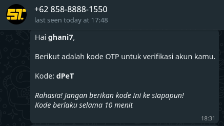
</p>

## API Payment Gateway

## Integrasi Flutter dan API

Untuk mengintergasikan flutter dan api membutuhkan package HTTP untuk mengirim request melalui protokol HTTP.

### Import HTTP

Tambahkan kode ini di paling atas file untuk import package HTTP

```dart
import 'package:http/http.dart' as http;
```

### Login

Function `login()` ini akan dipanggil saat tombol di klik (`onPressed`).

```dart
Future<void> login() async {
	// mereset state
	setState(() {
		errorMessage = "";
		loading = true;
	});

	// melakukan request ke API yang telah saya hosting untuk melakukan login
	// dengan mengirimkan username dan password sebagai body.
	final rawResponse = await http.post(
		Uri.parse("https://mwsapi.safatanc.com/auth/login"),
		body: jsonEncode(
			{
				"username": usernameController.text,
				"password": passwordController.text
			},
		),
	);

	// Melakukan konversi dari Json -> Map -> Object Model APIResponse
	final Map parseResponse = json.decode(rawResponse.body);
	final response = APIResponse.fromJson(parseResponse);

	if (response.code == 200) {
		// Melakukan konversi dari APIResponse Data -> Object Model User
		final user = User.fromJson(response.data);

		// Mengubah screen ke screen OTP
		Navigator.of(context).push(
			MaterialPageRoute(
				builder: (context) => OTPPage(
					user: user,
				),
			),
		);
	} else {
		// Jika error akan mengubah state errorMessage agar bisa ditampilkan
		setState(() {
			errorMessage = response.message;
		});
	}

	setState(() {
		loading = false;
	});
}
```

### Register

Penggunaan nya mirip seperti Login dari, hanya menyesuaikan endpoint dan body untuk request nya

```dart
Future<void> register() async {
	setState(() {
		errorMessage = "";
	});

	final rawResponse = await http.post(
		Uri.parse("https://mwsapi.safatanc.com/auth/register"),
		body: jsonEncode(
			{
				"username": usernameController.text,
				"password": passwordController.text,
				"full_name": fullNameController.text,
				"phone": phoneController.text
			},
		),
	);

	final Map parseResponse = json.decode(rawResponse.body);
	final response = APIResponse.fromJson(parseResponse);

	if (response.code == 200) {
		Navigator.of(context).pop();
	} else {
		setState(() {
			errorMessage = response.message;
		});
	}
}
```

### OTP Verify

Penggunaan nya mirip seperti Login, hanya menyesuaikan endpoint dan body untuk request nya

```dart
Future<void> verify() async {
	setState(() {
		errorMessage = "";
		loading = true;
	});

	final rawResponse = await http.post(
		Uri.parse("https://mwsapi.safatanc.com/auth/otp"),
		body: jsonEncode(
			{"username": widget.user.username, "code": codeController.text},
		),
	);

	final Map parseResponse = json.decode(rawResponse.body);

	final response = APIResponse.fromJson(parseResponse);

	if (response.code == 200) {
		Navigator.of(context).pushReplacement(
			MaterialPageRoute(
				builder: (context) => HomePage(user: widget.user),
			),
		);
	} else {
		setState(() {
			errorMessage = response.message;
		});
	}

	setState(() {
		loading = false;
	});
}
```

### Upgrade Account (Create Payment)

Disini user akan menklik tombol upgrade untuk melakukan pembayaran. <br>
Data payment akan dikirim ke halaman PaymentPage untuk menampilkan halaman pembayaran dari Xendit (Payment Gateway).

```dart
Future<void> upgrade() async {
	setState(() {
		errorMessage = "";
		loading = true;
	});

	final rawResponse = await http.post(
		Uri.parse("https://mwsapi.safatanc.com/payment"),
		body: jsonEncode(
			{"username": widget.user.username, "amount": 1000},
		),
	);

	final Map parseResponse = json.decode(rawResponse.body);

	final response = APIResponse.fromJson(parseResponse);

	if (response.code == 200) {
		final payment = Payment.fromJson(response.data);

		Navigator.of(context).push(
			MaterialPageRoute(
				builder: (context) =>
						PaymentPage(user: widget.user, payment: payment),
			),
		);
	} else {
		setState(() {
			errorMessage = response.message;
		});
	}

	setState(() {
		loading = false;
	});
}
```

### WebView Xendit/Payment

```dart
@override
Widget build(BuildContext context) {
	// Menyiapkan controller untuk halaman xendit
	final controller = WebViewController()
		..setJavaScriptMode(JavaScriptMode.unrestricted)
		..loadRequest(Uri.parse(widget.payment.url));

	return Scaffold(
		...
		body: Column(
			children: [
				Expanded(
					// Menampilkan halaman Xendit
					child: WebViewWidget(controller: controller),
				),
				...
			],
		),
	);
}
```

### Confirm/Refresh Payment Status

Berbeda dengan sebelumnya, disini hanya menggunakan method GET dan tidak memerlukan body. <br>

Saat status payment sudah tidak PENDING, maka user akan di redirect kembali ke halaman Home.

```dart
Future<void> check() async {
	setState(() {
		errorMessage = "";
		loading = true;
	});

	// Menggunakan GET saja
	final rawResponse = await http.get(
		Uri.parse(
			"https://mwsapi.safatanc.com/payment/reference_id/${widget.payment.referenceId}",
		),
	);

	final Map parseResponse = json.decode(rawResponse.body);

	final response = APIResponse.fromJson(parseResponse);

	if (response.code == 200) {
		final payment = Payment.fromJson(response.data);

		if (payment.status != "PENDING") {
			Navigator.of(context).pop();
		}
	} else {
		setState(() {
			errorMessage = response.message;
		});
	}

	setState(() {
		loading = false;
	});
}
```
